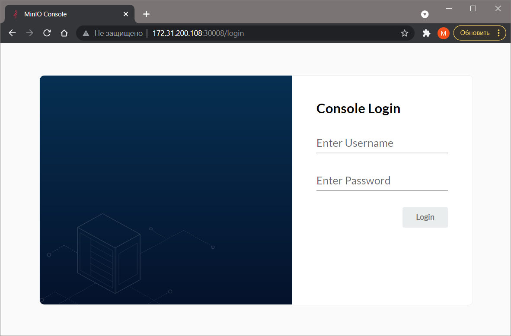
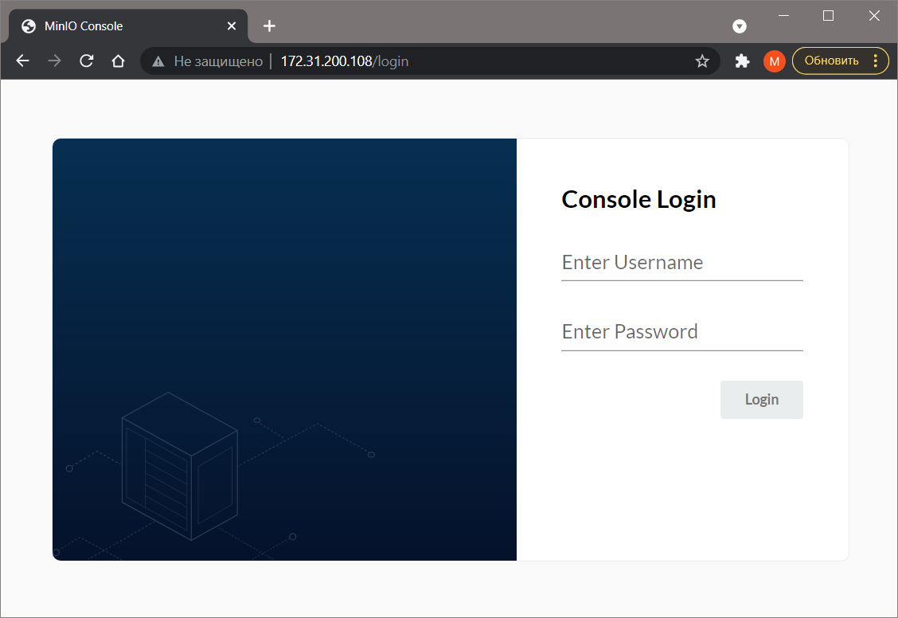
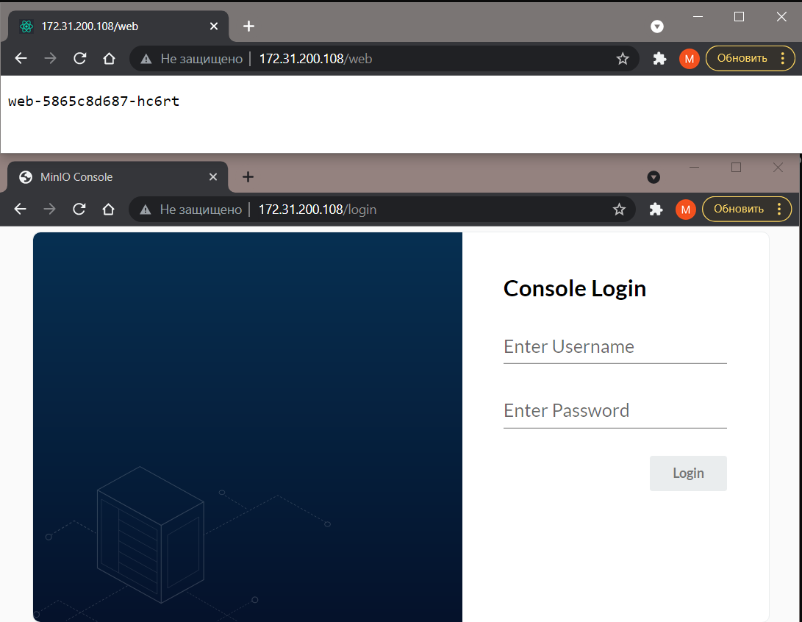

# Task 3
### [Read more about CSI](https://habr.com/ru/company/flant/blog/424211/)
Done.
### Create pv in kubernetes
```bash
$ kubectl apply -f pv.yaml
persistentvolume/minio-deployment-pv created
```
### Check our pv
```bash
$ kubectl get pv
NAME                  CAPACITY   ACCESS MODES   RECLAIM POLICY   STATUS      CLAIM   STORAGECLASS   REASON   AGE
minio-deployment-pv   5Gi        RWO            Retain           Available                                   42s
```
### Create pvc
```bash
$ kubectl apply -f pvc.yaml
persistentvolumeclaim/minio-deployment-claim created
```
### Check our output in pv 
```bash
$ kubectl get pv
NAME                  CAPACITY   ACCESS MODES   RECLAIM POLICY   STATUS   CLAIM                            STORAGECLASS   REASON   AGE
minio-deployment-pv   5Gi        RWO            Retain           Bound    default/minio-deployment-claim                           2m19s
```
Output has changed. PV got status bound.
### Check pvc
```bash
$ kubectl get pvc
NAME                     STATUS   VOLUME                CAPACITY   ACCESS MODES   STORAGECLASS   AGE
minio-deployment-claim   Bound    minio-deployment-pv   5Gi        RWO                           95s
```
### Apply deployment minio
```bash
$ kubectl apply -f deployment.yaml
deployment.apps/minio created
```
### Apply svc nodeport
```bash
$ kubectl apply -f minio-nodeport.yaml
service/minio-app created
```
Open minikup_ip:node_port in you browser:

### Apply statefulset
```bash
$ kubectl apply -f statefulset.yaml
statefulset.apps/minio-state created
service/minio-state created
```
### Check pod and statefulset
```bash
$ kubectl get pod
NAME                     READY   STATUS    RESTARTS   AGE
minio-6db846bd9f-827s8   1/1     Running   0          13m
minio-state-0            1/1     Running   0          6s
$ kubectl get sts
NAME          READY   AGE
minio-state   1/1     2m59s
```

### Homework
* We published minio "outside" using nodePort. Do the same but using ingress.
```bash
$ kubectl expose deployment minio
service/minio exposed

$ kubectl create ingress ingminio --rule="/*=minio:9001"
ingress.networking.k8s.io/ingminio created

$ kubectl get ingress ingminio
NAME       CLASS   HOSTS   ADDRESS     PORTS   AGE
ingminio   nginx   *       localhost   80      32s
```
Result:


* Publish minio via ingress so that minio by ip_minikube and nginx returning hostname (previous job) by path ip_minikube/web are available at the same time.
```bash
$ kubectl expose deployment web
service/web exposed

$ kubectl get svc web
NAME   TYPE        CLUSTER-IP      EXTERNAL-IP   PORT(S)   AGE
web    ClusterIP   10.102.141.17   <none>        80/TCP    52s

$ kubectl edit ingress ingminio
```
Add the following section
```yaml
      - backend:
          service:
            name: web
            port:
              number: 80
        path: /web
        pathType: Prefix
```
Result:


* Create deploy with emptyDir save data to mountPoint emptyDir, delete pods, check data.

emptydir.yaml contents:
```yaml
apiVersion: apps/v1
kind: Deployment
metadata:
  name: nginx-emptydir
spec:
  selector:
    matchLabels:
      app: nginx
  template:
    metadata:
      labels:
        app: nginx
    spec:
      containers:
      - image: nginx
        imagePullPolicy: Never
        name: nginx
        volumeMounts:
        - mountPath: /test
          name: emptydir
      volumes:
      - emptyDir: {}
        name: emptydir
```
Creating the deployment:
```bash
$ kubectl apply -f emptydir.yaml
deployment.apps/nginx-emptydir created

$ kubectl get pods
NAME                              READY   STATUS    RESTARTS   AGE
nginx-emptydir-5f75794f9d-b8r48   1/1     Running   0          4s
```
Connect to the pod and create test file:
```bash
$ kubectl exec -ti nginx-emptydir-5f75794f9d-b8r48 -- bash

root@nginx-emptydir-5f75794f9d-b8r48:/# df | grep test
/dev/sda1       17784752 2155164  14589352  13% /test

root@nginx-emptydir-5f75794f9d-b8r48:/# touch /test/myfile
root@nginx-emptydir-5f75794f9d-b8r48:/# ls -l /test/
total 0
-rw-r--r-- 1 root root 0 Nov 17 11:51 myfile
root@nginx-emptydir-5f75794f9d-b8r48:/#
exit
$
```
Connect and check once again. The file is still there:
```bash
$ kubectl exec -ti nginx-emptydir-5f75794f9d-b8r48 -- bash
root@nginx-emptydir-5f75794f9d-b8r48:/# ls -l /test
total 0
-rw-r--r-- 1 root root 0 Nov 17 11:51 myfile
root@nginx-emptydir-5f75794f9d-b8r48:/#
exit
$
```
Delete pod and connect to new one:
```bash
$ kubectl delete pod nginx-emptydir-5f75794f9d-b8r48
pod "nginx-emptydir-5f75794f9d-b8r48" deleted

$ kubectl get pod | grep empty
nginx-emptydir-5f75794f9d-pk99b   1/1     Running   0          4m16s

$ kubectl exec -ti nginx-emptydir-5f75794f9d-pk99b -- bash
root@nginx-emptydir-5f75794f9d-pk99b:/# df | grep test
/dev/sda1       17784752 2155164  14589352  13% /test
root@nginx-emptydir-5f75794f9d-pk99b:/# ls -l /test
total 0
```
The volume is mounted, but the dir is empty, as expected.

* Optional. Raise an nfs share on a remote machine. Create a pv using this share, create a pvc for it, create a deployment. Save data to the share, delete the deployment, delete the pv/pvc, check that the data is safe.
